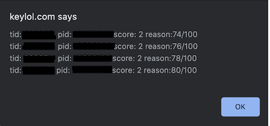

# Keylol-Autorate

## 安装
1.安装 [Tampermonkey](https://tampermonkey.net/)

2.[点击安装](https://github.com/DreamNya/Keylol-Autorate/raw/DreamNya-patch-1/keylol-autorate.user.js) 脚本 

## 使用
1.收藏需要加体力用户的帖子，收藏说明按照`已加体力/全部体力`格式填写
```
  例如：一般收藏体力交易帖，收藏说明填写`0/100`
```
  
2.点击右上方用户栏内`Autorate`按钮，将根据用户等级自动加体力并填写评分理由，最终更新收藏说明
```
  例如：帖子收藏说明为`72/100`, 你的用户等级为4级（8点体力/天，2点体力/次）
       自动加4次体力每次加2点，评分理由分别填写74/100, 76/100, 78/100, 80/100
       最终更新帖子收藏说明为`80/100`
```



## Q&A
1.Q:收藏帖有其他帖子可以吗？

A: 不影响收藏本身功能使用，脚本会自动筛选收藏说明为`<Number>/<Number>`格式的帖子

2.Q:加体力分配原则是什么？

A: 尽量平分体力在多个需要加体力的帖子，无法平均时优先加快加完的帖子

更多说明：见原作者发布的原帖https://keylol.com/t630781-1-1
